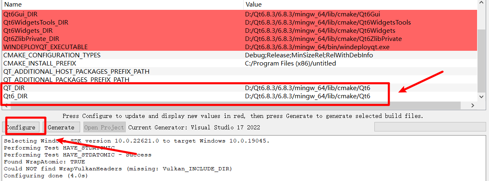
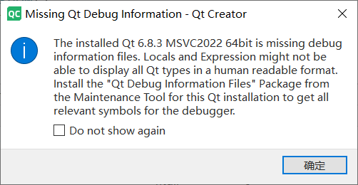
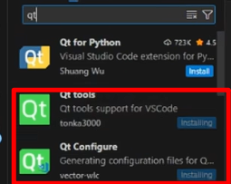
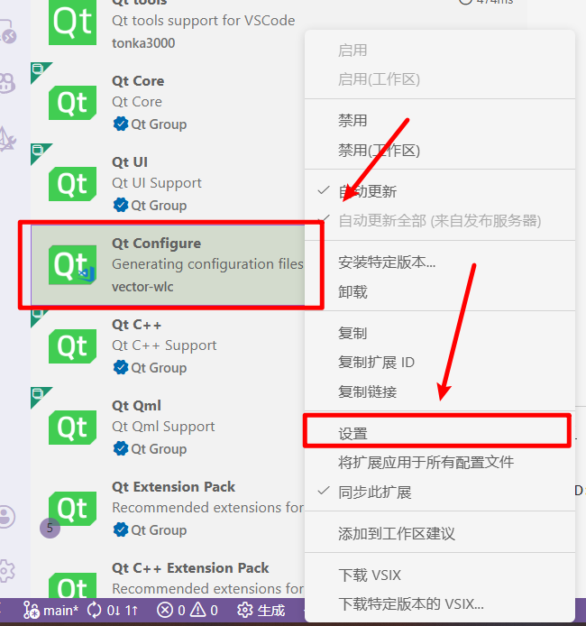
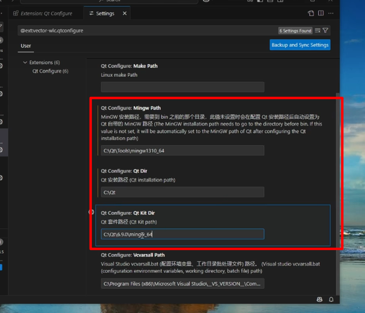
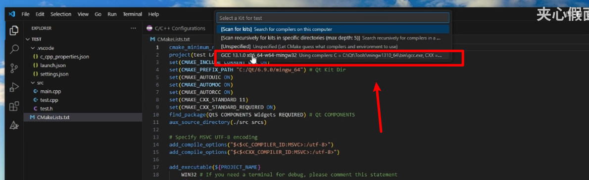

## 手搓编译

1. 第一步指明qt库位置，编译器位置，哪种生成器:`cmake -B ./build/Desktop_Qt_6_8_3_MinGW_64_bit-Debug -DCMAKE_BUILD_TYPE=Debug -DCMAKE_PREFIX_PATH="D:/Qt6.8.3/6.8.3/mingw_64" -DCMAKE_C_COMPILER="D:/Qt6.8.3/Tools/mingw1310_64/bin/gcc.exe" -DCMAKE_CXX_COMPILER="D:/Qt6.8.3/Tools/mingw1310_64/bin/g++.exe" -DCMAKE_MAKE_PROGRAM="D:/Qt6.8.3/Tools/Ninja/ninja.exe" -G Ninja`
   1. qtcreator的方法：[cmake] Running D:\cmake4.1\bin\cmake.exe -S D:/myfile/myproject/test_project/test-qtcreator-qt6.8.3-cmake -B D:/myfile/myproject/test_project/test-qtcreator-qt6.8.3-cmake/build/Desktop_Qt_6_8_3_MinGW_64_bit-Debug "-DCMAKE_COLOR_DIAGNOSTICS:BOOL=ON" "-DCMAKE_BUILD_TYPE:STRING=Debug" "-DCMAKE_CXX_FLAGS_INIT:STRING=-DQT_QML_DEBUG" "-DQT_QMAKE_EXECUTABLE:FILEPATH=D:/Qt6.8.3/6.8.3/mingw_64/bin/qmake.exe" "-DCMAKE_C_COMPILER:FILEPATH=D:/Qt6.8.3/Tools/mingw1310_64/bin/gcc.exe" "-DQT_MAINTENANCE_TOOL:FILEPATH=D:/Qt6.8.3/MaintenanceTool.exe" "-DCMAKE_GENERATOR:STRING=Ninja" "-DCMAKE_PROJECT_INCLUDE_BEFORE:FILEPATH=D:\myfile\myproject\test_project\test-qtcreator-qt6.8.3-cmake\build\Desktop_Qt_6_8_3_MinGW_64_bit-Debug/.qtc/package-manager/auto-setup.cmake" "-DCMAKE_CXX_COMPILER:FILEPATH=D:/Qt6.8.3/Tools/mingw1310_64/bin/g++.exe" "-DCMAKE_PREFIX_PATH:PATH=D:/Qt6.8.3/6.8.3/mingw_64" in D:\myfile\myproject\test_project\test-qtcreator-qt6.8.3-cmake\build\Desktop_Qt_6_8_3_MinGW_64_bit-Debug.
   2. 
2. 第二步还是老配方:`cmake --build ./build/Desktop_Qt_6_8_3_MinGW_64_bit-Debug`
   1. 指定项目编译：cmake --build ./build/Desktop_Qt_6_8_3_MinGW_64_bit-Debug --target mytest_minimize


### cmake gui编译

Qt6_DIR和QT_DIR都是一个；路径，直接在表格中填写即可

```
D:/Qt6.8.3/6.8.3/mingw_64/lib/cmake/Qt6
```





## 4大ide

### clion

不想弄了，对qt的支持版本号，啥玩意都要自己配


### qt creator

`项目路径依然不支持中文，有毒`

#### 这个Qt Debug Information Files不用安装



太大了，不安装，msvc也能调试：


### vscode

#### 安装

[Vscode或vs2022配置Qt项目_哔哩哔哩_bilibili](https://www.bilibili.com/video/BV1QmjKzaEaN/?spm_id_from=333.337.search-card.all.click&vd_source=6bed52958ded6f91dd38a86ae487d199)

安装：



添加环境变量：

D:\Qt6.8.3\6.8.3\mingw_64\bin

D:\Qt6.8.3\Tools\mingw1310_64\bin


设置路径：

D:\Qt6.8.3\Tools\mingw1310_64

D:\Qt6.8.3

D:\Qt6.8.3\6.8.3\mingw_64









