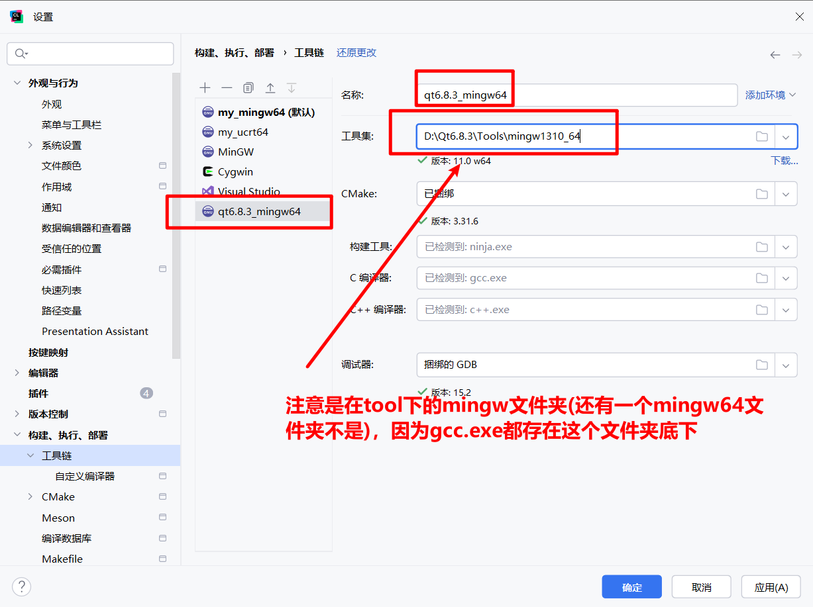

## 老配方编译

```
cmake -B build -DCMAKE_PREFIX_PATH=D:/Qt6.8.3/6.8.3/mingw_64/ -DCMAKE_BUILD_TYPE=RelWithDebInfo

cmake --build build
```


## 4大ide

### clion

不想弄了，对qt的支持版本号，啥玩意都要自己配



### qt creator

`项目路径依然不支持中文，有毒`


